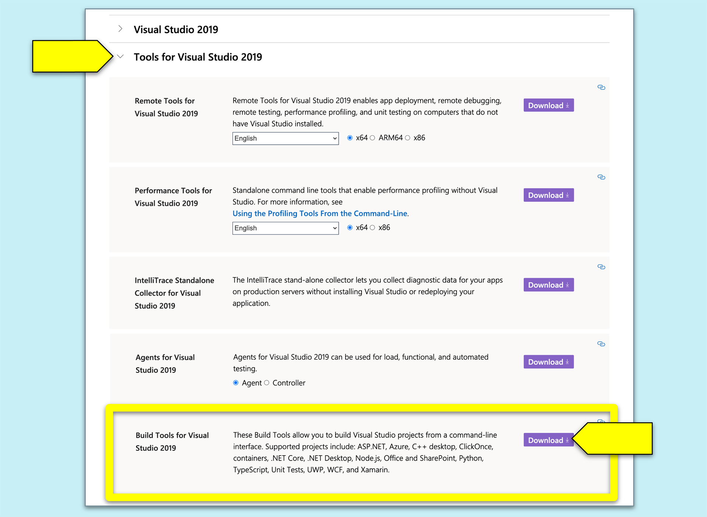

# Blockchain Transactions Troubleshooting Guide

It can be frustrating when packages do not install correctly, therefore use the below approaches to troubleshoot any installation or usage issues.

## Install Microsoft Visual C++ Build Tools In Windows

In some cases, the `Web3.py` library may fail to install in Microsoft Windows due to the need for Microsoft Visual C++ Build Tools. In such an event, follow the below steps to resolve the issue:

1. Go to: https://visualstudio.microsoft.com/downloads/

2. Scroll down the page and click on "Tools for Visual Studio 2019" to reveal the sub-options.

3. Download the "Build Tools for Visual Studio 2019" package.

    

4. Run the package file and select the C++ build tools option. Then click install.

5. This process takes about 15 minutes

## Issues Installing `bit` or `web3` After Installing the Microsoft Visual C++ Build Tools In Windows

Along the installation process of `bit` or `web3` you may experience an issue related with the Microsoft Visual C++ Build tools in Windows if you update Windows after installing the build tools, and before installing these Python libraries.

You may see an error message that states `wheel is not supported`, the solution for this issue is to uninstall and reinstall the Microsoft Visual C++ Build Tools.

## Update Conda Environment

An out-of-date Anaconda environment can create issues when trying to install new packages. Follow the below steps to update your conda environment.

1. Deactivate your current conda environment. This is required in order to update the global conda environment. Be sure to quit any running applications, such as Jupyter, prior to deactivating the environment.

    ```shell
    conda deactivate
    ```

2. Update conda.

    ```shell
    conda update conda
    ```

3. Reactivate your environment and attempt the installations again.
